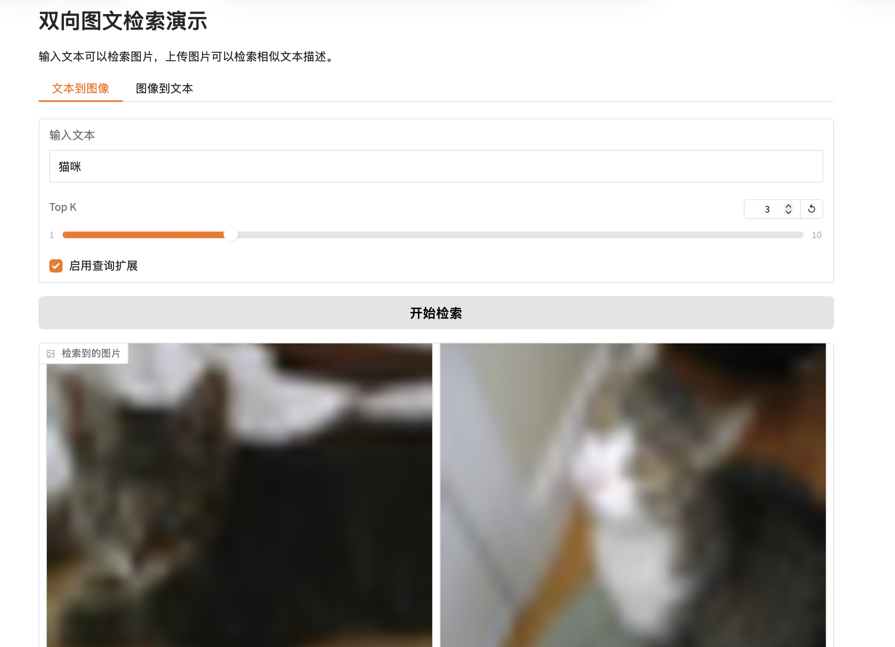
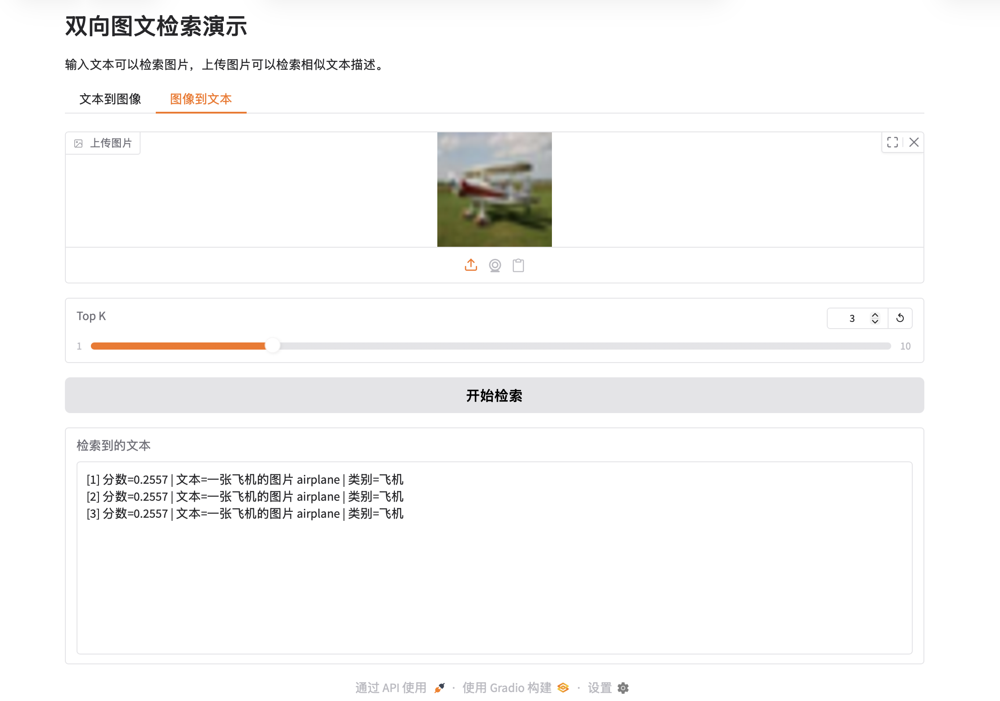

# 基于 OpenCLIP 的双向图文检索原型

项目围绕 **CIFAR-10 小规模图文对 + OpenCLIP 向量编码 + 双向检索 + Recall@K 评测 + Gradio 演示** 展开，重点展示多模态检索的完整流程。

## 项目亮点

- 使用 CIFAR-10 自动构建中英双语图文对数据
- 使用 OpenCLIP 提取图像与文本向量
- 支持 Text → Image 与 Image → Text 双向检索
- 支持基于同义词表的短查询扩展
- 支持 Recall@K 离线评测
- 支持可选的 FAISS 近似最近邻索引
- 支持 Gradio 可视化演示

## 目录结构

```text
multimodal-retrieval-CLIP/
  README.md
  FILE_GUIDE.md
  PROJECT_RELEASE_NOTES.md
  requirements.txt
  .gitignore
  mm_utils.py
  prepare_cifar10_dataset.py
  encode_data.py
  search_text_to_image.py
  search_image_to_text.py
  build_ann_index.py
  evaluate_recall.py
  query_expansion_demo.py
  run_pipeline.py
  app.py
  docs/
    project_report.md
  data/
    images/
  artifacts/
```

## 环境安装

```bash
pip install -r requirements.txt
```

如果需要近似最近邻索引，可以额外安装：

```bash
pip install faiss-cpu
```

## 推荐运行顺序

### 方式一：一步跑主流程

```bash
python run_pipeline.py
```

### 方式二：逐步运行

```bash
python prepare_cifar10_dataset.py
python encode_data.py
python build_ann_index.py
python search_text_to_image.py --query "一只猫 cat" --topk 5
python search_image_to_text.py --image-path "data/images/cat_0000.png" --topk 5
python evaluate_recall.py --k-values 1 5 10
python query_expansion_demo.py --query "猫咪"
python app.py
```

## 方法说明

### 1. 数据准备

使用 CIFAR-10 训练集，每个类别抽取固定数量样本，统一缩放到指定大小，并生成中英双语 caption。

### 2. 向量编码

使用 OpenCLIP 将图像和文本映射到同一向量空间，并对输出向量做归一化处理。归一化后，向量点积可以直接作为余弦相似度使用。

### 3. 双向检索

- Text → Image：用文本查询向量和图像向量库做相似度匹配
- Image → Text：用图像查询向量和文本向量库做相似度匹配

### 4. 查询扩展

针对中文短查询，项目提供一个轻量同义词扩展策略，例如将“猫咪”扩展为“猫、猫咪、cat、kitty”，再对多个查询向量取平均后检索。

### 5. 评测

- Text → Image：使用同类别命中作为 Recall@K 标准
- Image → Text：使用一一对齐的 exact match 作为基线评测方式

## Demo




## 项目定位

这是一个 **小规模多模态检索原型项目**。它的重点是展示是否理解并实现了完整的图文检索链。
